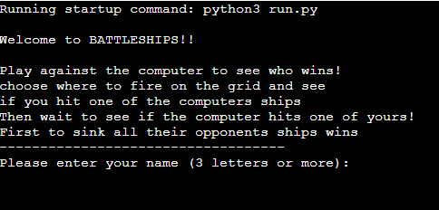
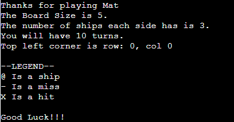
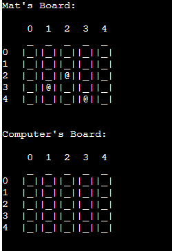

# Battleships Game

Battleships is a Python-based terminal game where players engage in a battle against the computer. The objective is to sink all three of the opponent's ships on the playboard. Each player has 10 turns to make their shots by guessing coordinates. This game is hosted on the Code Institute's mock terminal on Heroku.

A live link to the game can be found here: [Battleships Game](https://mattleships-1ef855055238.herokuapp.com/).

## How to play

The game is played with two boards, one for each pplayer.

Each game board is a 5 x 5 grid labeled from 0 to 4. the player chooses a coordinate to guess where the computers ship is. The computer does the same.

On a player's board, ships are represented by '@' symbols. When an opponent successfully hits a ship, that coordinate is marked with an 'X'. A miss is indicated by a '*' symbol.

The computers board does not display the ships. Only the hits and misses

Players are given 10 turns each to try and hit all three ships.

Players have the option to exit the game if they choose to do so before each turn.

## Site Owner Goals  

- To offer the user an enjoyable and straightforward gaming experience.

- To ensure the game is well-designed and user-friendly, making it easy to navigate.

- To allow the user the option to play another round or request a rematch.

## User Stories 

- ### As a first time user, I want to: 

- I wish to quickly grasp the game's instructions.

- I want a game that is both simple and enjoyable to play.

- I seek the option to exit the game whenever I choose.

- I want the ability to play another round once the current game concludes.

## Flowchart  

I sketched out a flowchart to clearly grasp the game's underlying logic and structure.

This tool was instrumental in organizing my project, particularly in verifying user inputs.

The flowchart's logic guided me in determining the types of functions to develop and how these functions should interact with one another.

 

## Features 

#### Username Input & Instructions  

The game begins with the game title and a brief desciption of the game.
The user is then prompted to enter a username.

 

#### Game initialisation

The game is started. Some information is displayed about the game
- The board size
- The number of ships each side has
- the number of turns each player has
- A description of the numbers of the board

 

A random function generates the positions of the computers boards

The two boards are then displayed, the players board with his ships visible and indicated by a "@" symbol and the computers board showing no ships.

 

The player is prompted to first quess a row that the computers ships may be in, and then guess a column. 

Once a valid input is made, A message is displayed stating weather your guess hit a ship and/or the computers guess hit one of the players ships.

If the player enters an invalid input, an error message is displayed and the player is prompted to re-enter

 

The two boards are displayed again reflecting this result.

- if one of the players hits a ship, an "X" is displayed
- A miss is indicated by a "0"

The number of turns taken and number of turns left is displayed and if there are turns left and no one has won, the player is once again prompted to enter a row and column guess.

 

Whenever the player is asked to enter new coordinates, an option is given as to weather the player wants to quit or continue playing. If they enter "quit" they are then finally asked to press any key to quit or press "Y" to return to the game.

 

### Future Features 

Possible future features to be developed

- To Adjust level of dificulty for the player by altering a combination of board size, number of turns and number of ships
- TO be able to keep both computer and players score
- to have different sizes of ships. Perhaps related to the chosen difficulty.
- To improve the graphical display.

## Technologies Used 

 - Python 
 - Heroku
 - Gitpod

## Data Model

In this game, I am using several classes as my data model.

### Board Class

This class stores the information required for generating both the player board and the computer board

It includes all of the functions of the game such as the boardsize, ship size, ship location.

### Game Class

The game class includes all the information needed while playing the game. the guesses of coordinates of both the player and the computer, if it was a hit or miss, the remaining turns, and all of the other details on how the game is played.  

### User Class

The user class includes all the details for the user such as user name and score

## Testing  

 

- The game code has been tested with the [PEP8](https://pep8ci.herokuapp.com/#) linter and all errors were addressed and fixed.  

- The players inputs have been manually tested on the Code Institute Heroku terminal and is working without any errors: 

  - Invalid Username 

    - Empty Character 

  - Invalid Coordinates 

    - A number lower than 0 

    - A number higher than 4 

    - A letter (except for "Q")

    - A word or words

    - Empty Character 

# Credits

- [Code institute Love Sandwiches Project](https://github.com/tildeholmqvist/LoveSandwiches)
- [W3Schools](https://www.w3schools.com/)
- [Stack Overflow](https://stackoverflow.com/)
- [Battleships game by Mark Anthony Lleg](https://llego.dev/posts/how-code-simple-battleship-game-python/)
- [Python Battleship with Object Oriented Programming](https://www.youtube.com/watch?v=alJH_c9t4zw&t=275s&ab_channel=KnowledgeMavens)
- [Battleships game by Tilde Holm](https://github.com/tildeholmqvist/battleshipgame)
- And my mentor Antonio for all his help.
